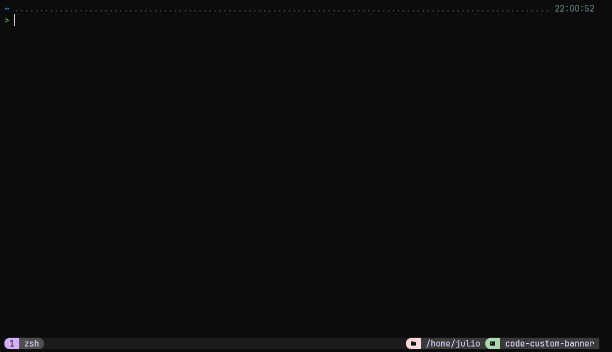

# Dotfiles WSL

> Modular Linux/WSL environment setup with GNU Stow

<p align="center">
  
</p>

These dotfiles are organized by package so each area (shell, tools, tmux, git, etc.) stays isolated, reproducible, and easy to maintain.

## Table of Contents
- [What is this project?](#what-is-this-project)
- [Getting Started](#getting-started)
- [Features](#features)
- [Project Structure](#project-structure)
- [How Setup Works](#how-setup-works)

## What is this project?

This repository provides a modular dotfiles setup for WSL/Linux using GNU Stow.

The main goals are:
- Keep configuration clean and package-based
- Automate dependency setup per package
- Apply symlinks safely with Stow
- Support installation with or without Git

## Getting Started

### Requirements

Before installation, ensure you have:
- `bash`
- `curl`
- `sudo` access

### Installation (without Git)

```bash
DOTFILES_BRANCH=main DOTFILES_DIR=$HOME/dotfiles curl -fsSL https://raw.githubusercontent.com/JulioC090/dotfiles-wsl/main/install.sh | bash
```

### Installation (local repository)

```bash
bash setup.sh
```

## Features

✅ Modular package-based setup (`packages/<name>`)

✅ Per-package installers (`setup.sh`) and post-install hooks (`post-install.sh`)

✅ Conflict cleanup before symlink creation

✅ Explicit Stow target/directory execution

✅ Supports shell/tooling/bootstrap for WSL workflows

## Project Structure

```text
dotfiles/
├── packages/
│   ├── bash/      # Bash dotfiles and setup
│   ├── bin/       # User scripts for ~/.local/bin
│   ├── docker/    # Docker installation setup
│   ├── git/       # Git configuration
│   ├── tmux/      # Tmux config and plugin setup
│   ├── tools/     # General tools (fzf, nvm, etc.)
│   ├── vscode/    # VS Code extension list + installer
│   └── zsh/       # Zsh config, plugins and shell setup
├── install.sh     # Installer entrypoint (no git required)
└── setup.sh       # Main orchestrator
```

## How Setup Works

When `setup.sh` runs, it:

1. Updates system packages
2. Installs GNU Stow
3. Runs each package `setup.sh`
4. Removes file conflicts in `$HOME`
5. Applies symlinks with Stow for selected packages
6. Runs each package `post-install.sh` (if present)

Manual Stow example:

```bash
stow --dir ./packages --target "$HOME" bash git zsh tmux bin
```
